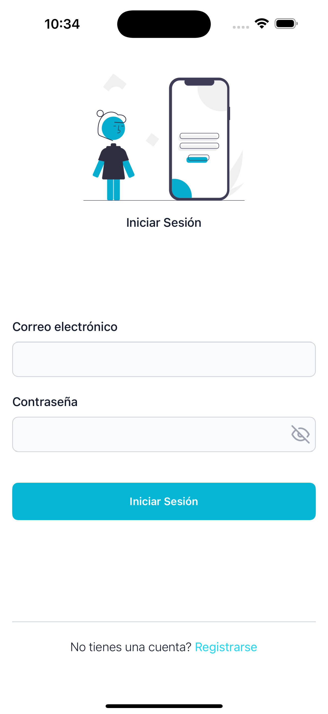
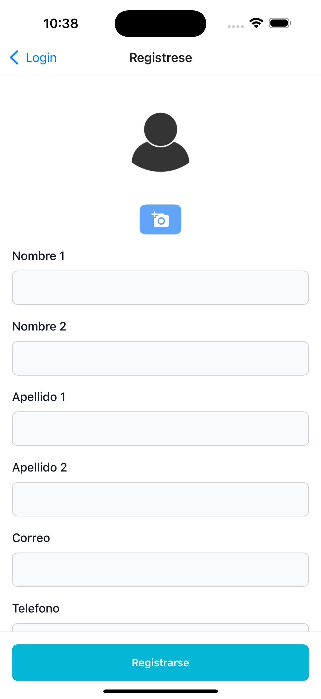
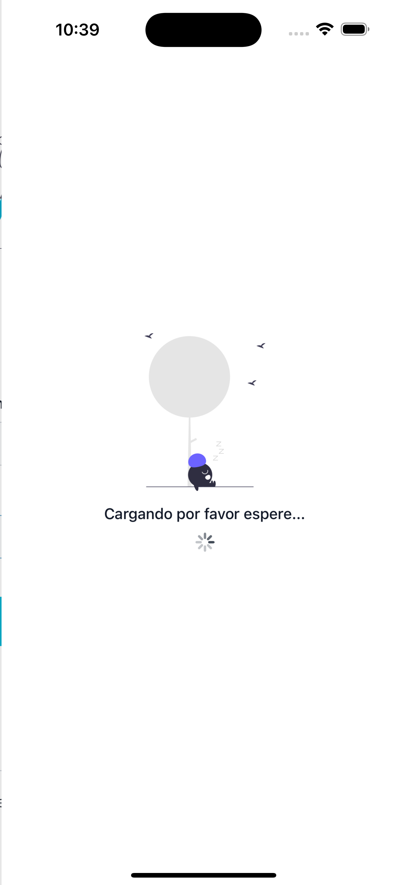
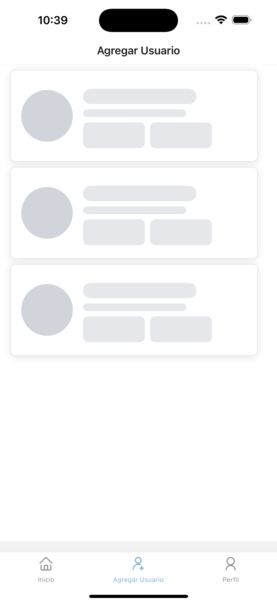
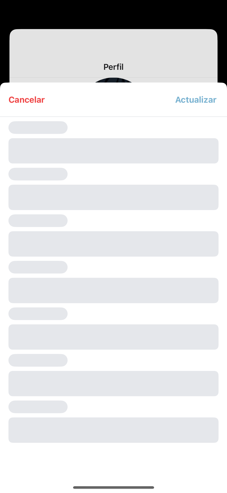
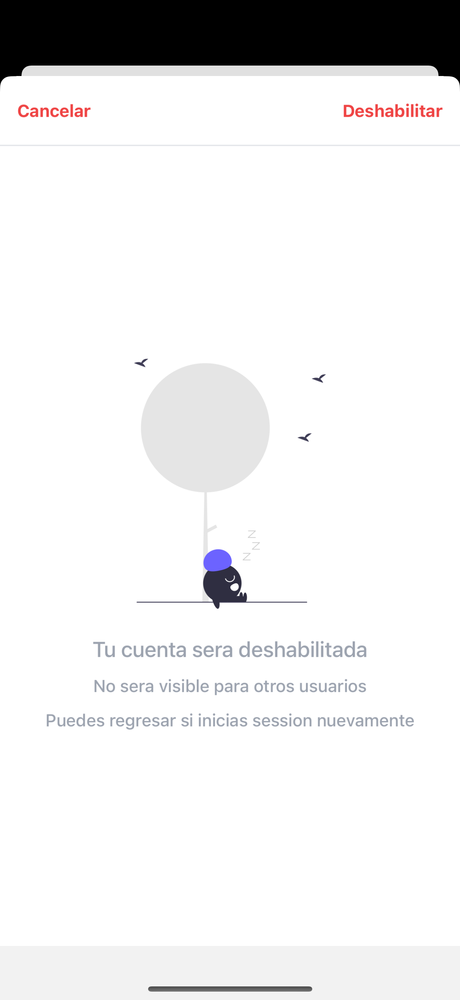

## 🚀 Pasos para el uso

Puedes descargar el apk si tienes un dispositivo Android [APK](https://drive.google.com/file/d/1XA4L8ep2tFpinrRGBIxQr65B2qVU_pjS/view?usp=sharing), lo instalas en tu dispositivo y estara listo para usarse.

Si deseas ejecutarlo en tu PC sigue estos pasos

1. Instalar [NodeJS](https://nodejs.org/en/), necesitamos tener instalado el empaquetador para usar `npm`
2. Clonar el repositorio usando el comando `git clone https://github.com/Mario-Tubay/AppPruebaCentralFile.git`.
3. Ejecutar el comando.
```bash
npm install
```
4. Necesita tener instalado el IDE `(ANDROID STUDIO)` o si prefiere Iphone `(XCode)` y seguir los pasos que recomienda [React Native](https://reactnative.dev/docs/set-up-your-environment) para configurar el ambiente para desarrollo.
5. Una vez seguido los pasos anterirores puede correr el proyecto usando el comando:
```bash
npx expo start 
```

Use el framework de [React Native](https://reactnative.dev/) mas popular y que la documentacion de react native recomienda que es [Expo](https://docs.expo.dev/) 

### Para el backend use el Framework de [Laravel](https://laravel.com/) puedes revisar el repositorio [Aqui](https://github.com/Mario-Tubay/BackPruebaCentralFile)

## ¿Cómo decidió las opciones técnicas y arquitectónicas utilizadas como parte de su solución?
Elegi [Expo](https://docs.expo.dev/)  por varias razones:
1. #### Desarrollo mucho mas rapido:
 Expo ofrece un entorno de desarrollo muy rápido y eficiente, lo que permite desarrollar aplicaciones sin necesidad de configurar un entorno nativo completo.

2. #### Acceso a funcionalidades: 
El framework ya viene listo y configurado para el uso de una gran cantidad de APIs, esto facilita la implementacion cuando se requiera el uso de la camara, notificaciones, etc...

3. #### Documentación:
Ya viene con una documentacion completa y muy facil de entender por lo que resolver problemas seria muy sencillo, ademas de la comunidad muy amplia que tiene ya que el uso de este framework cada vez es mas popular.

### ¿Qué haría de manera diferente sise le asignara más tiempo?
Me enfocaria en la optimización y carga de datos para que la aplicacion mehire la gestion de memoria, tambien la experiencia de usuario es muy importante, asi como la interfaz, la app esta optimizada en ciertas parte para el modo oscuro faltaria pulir las partes que aun no estan completamente optimizadas, hacer pruebas mas profundas seria otro de los puntos para que el usuario no experimente ninguna clase de errores.

###  ¿Para casos donde se deben guardar grandes cantidades de datos como por ejemplo varias fotos de alta calidad, que lógica manejaría para que la aplicación funcione de la forma más óptima?
Para estos casos se podria aplicar algunas estrategias 

1. El uso de de servicios en las nube: Como sabemos el manejor de imagenes aveces es un poco tedioso por suerte hay servicios que nos ayudan por mencionar algunos tenemos a [Cloudinary](https://cloudinary.com/) este servicio aparte de guardar en la nube las fotos tiene varios servicios mas como reducir imagen para al momento de usar api cargar el que se necesita especificamente, al igual tenemes [AWS](https://aws.amazon.com/es/).

2. Si lo estamos guardando en servidores propios o terceros lo mejor para que el espacio no se llene seria comprimir las imagenes, reducir su tamaño o su tipo, por ejemplo WebP que se esta usando cada vez mas porque es mas liviano.

### Algunas imagenes de la App 

### Login




### Registro


### Pantalla de carga


### Pantalla de carga de datos


### Pantalla de perfil


### Pantalla carga de formulario perfil


### Borrar cuenta
El borrar cuenta usa un borrado de datos a la base de datos 
> **⚠️ Advertencia:** Aunque nunca se debe hacer, se lo hizo esta vez para fines practico y porque la documentacion de la prueba lo requeria, solo esta opcion usa ese tipo de borrado


### Deshabilitar cuenta
Usa un borrado logico es decir cambia de estado en la base de datos de 1 a 0
> **⚠️ Advertencia:** Aunque nunca se debe hacer, se lo hizo esta vez para fines practico y porque la documentacion de la prueba lo requeria 


